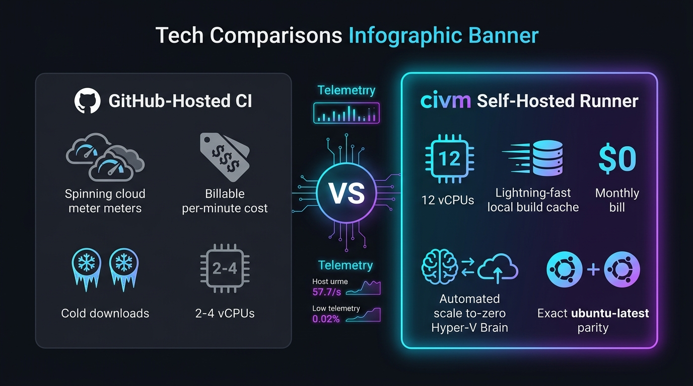

<p align="center">
  <a href="README.md"><b>English</b></a> •
  <a href="README.pt-BR.md">Português (Brasil)</a>
</p>

# civm

[](https://github.com/emersonbusson/civm/actions/workflows/ci.yml)
[](LICENSE)

**civm** is open-source tooling to **provision and operate self-hosted
GitHub Actions runners** on a Linux VM (with optional Windows Hyper-V host
helpers), with strict parity pins against `ubuntu-latest`, automated disk and
memory cleanups, health/doctor checks, and copy-paste workflow templates.

| You want… | Use… |
| --- | --- |
| Install / maintain the runner VM | `civmctl` (this repository, in Go) |
| Windows scale-to-zero Hyper-V brain | sibling project **civm-host** (optional) |
| CI for your product repositories | your repositories + `templates/*.yml.template` |

**What civm is not**

- Not a custom application CI orchestrator (GitHub Actions remains the scheduler).
- Not a code linter product — project-specific audits remain inside each application repo.
- Not a multi-tenant SaaS fleet: **you** configure and control which `owner/repo` list a box serves.

<p align="center">
  
</p>

## Why civm? (civm vs GitHub-Hosted CI)

| Dimension / Feature | GitHub-Hosted Standard (`ubuntu-latest`) | civm Self-Hosted Architecture | Advantage with `civm` |
| --- | --- | --- | --- |
| **Monthly Cost** | Paid per minute ($0.008/min beyond quota) | **$0.00 / month** (Runs on your dedicated host/VM) | **Zero recurring cloud bill** |
| **Compute Power** | 2–4 vCPUs / 7–16 GB RAM | **12 vCPUs / 12–32 GB RAM** (Full host thread utilization) | **3x to 6x faster builds & test suites** |
| **Build Caches & Docker** | Cold start per job (downloads layers via network) | **Hot local SSD caches** (`_work/_tool`, local Docker cache) | **Near-instant checkout & image prep** |
| **Host Power Management** | Cloud provider managed | **Automated Scale-to-Zero Hyper-V Brain** | **Zero idle power consumption** |
| **OS & Tool Parity** | `ubuntu-latest` (Ubuntu 24.04 LTS) | **Strict Parity Pins** (`civmctl version-pins` / `parity`) | **100% workflow compatibility** |
| **Queue Hygiene** | Cancel-in-progress only in same workflow | **Smart Cross-Repo Reaper** (reaps closed PRs & stale SHAs) | **Zero queue clogging & wasted CPU** |
| **Disk & Memory Defense** | Ephemeral discard | **Autonomous Watchdogs** (emergency disk trim, fstrim, VHDX shrink) | **Self-healing 24/7 reliability** |
| **Intelligent Routing** | Single backend | **Dynamic CI Router** (auto-fallback between Cloud & civm) | **Resilient hybrid architecture** |

## License

[MIT](LICENSE) — see [CONTRIBUTING.md](CONTRIBUTING.md) and [SECURITY.md](SECURITY.md).

## Windows Hyper-V host (optional scale-to-zero)

Production host brain today: PowerShell under `deploy/windows/`. Control-plane
tasks run as **SYSTEM**, while `civm-gate` runners use
`NETWORK SERVICE/ServiceAccount/Limited` with protected least-privilege ACLs.
Configure **`Repos`** and **`TokenPaths`** on the host (empty in-repo defaults by design).
Prefer a **host-local lab wrapper** so organization and repository fleet details never land in git.

- Runbook: [`runbooks/HOST-ORCHESTRATOR-SETUP.md`](runbooks/HOST-ORCHESTRATOR-SETUP.md)
- Behavior: [`docs/specs/orchestrator-scale-to-zero/`](docs/specs/orchestrator-scale-to-zero/)
- Optional C# port (shadow until cutover): sibling project **civm-host**

## Bootstrap (guest Ubuntu 24.04)

On a clean Ubuntu 24.04 LTS VM (as a user with sudo privileges):

```bash
git clone https://github.com/emersonbusson/civm.git /opt/civm   # or your fork
cd /opt/civm
go build -o /usr/local/bin/civmctl ./cmd/civmctl
sudo civmctl bootstrap --execute
sudo cp deploy/systemd/civmctl-*.service deploy/systemd/civmctl-*.timer /etc/systemd/system/
sudo install -d -m 0755 /etc/civm
printf '%s
' 'CIVM_REAPER_REPOS=<owner/repo[,owner/repo]>' |   sudo tee /etc/civm/run-reaper.env >/dev/null
sudo systemctl daemon-reload
sudo systemctl enable --now   civmctl-cleanup.timer civmctl-disk-watchdog.timer   civmctl-runner-watchdog.timer civmctl-reverse-watchdog.timer   civmctl-metrics.timer civmctl-run-reaper.timer
civmctl parity
civmctl health
```

Register a runner (tokens are ephemeral and must never be committed):

```bash
TOKEN=$(gh api -X POST /repos/<owner>/<repo>/actions/runners/registration-token --jq .token)
civmctl runner add --repo=<owner>/<repo> --token="$TOKEN" --short=<short> --execute
```

Prefer **one organization-level runner** when many repositories share a box (to ensure clean job serialization).
See [`runbooks/RUNNER-SERIALIZATION.md`](runbooks/RUNNER-SERIALIZATION.md) and [`runbooks/ORG-RUNNER-ADOPTION.md`](runbooks/ORG-RUNNER-ADOPTION.md).

Full multi-runner / disk / host architecture notes: [`runbooks/MULTI-PROJECT-RUNNER.md`](runbooks/MULTI-PROJECT-RUNNER.md).

## civmctl Commands

| Command | Description |
|---|---|
| `civmctl version-pins` | Prints target tool versions (parity with `ubuntu-latest`) |
| `civmctl parity [--json]` | Validates installed tools on the VM against authoritative pins |
| `civmctl bootstrap [--execute]` | Provisions the Ubuntu 24.04 VM (default: dry-run) |
| `civmctl cleanup [--execute] [--managed-volumes]` | Cleans Docker, `/tmp`, old `_work` artifacts, and apt cache; preserves `_work/_tool` and `_work/_actions`; `--managed-volumes` removes classified Compose volumes; aborts if active job/build detected |
| `civmctl health` | System health check (disk, memory, runners, and last cleanup status) |
| `civmctl doctor [--repos=auto|owner/repo,...|none] [--json]` | Read-only consolidated diagnosis: host, hooks, systemd runner units, and GitHub Actions API |
| `civmctl idle-check [--json]` | Read-only idleness detector: exits `0=idle`, `1=busy`, `2=unknown` |
| `civmctl hook install [--execute] [--runner-glob=...]` | Reconciles and installs `ACTIONS_RUNNER_HOOK_*` scripts and runner `.env` |
| `civmctl runner add` | Registers and starts a self-hosted GitHub Actions runner in one command |
| `civmctl runner remove` | Safely unregisters and removes a runner (fail-closed if stop/uninstall fails) |
| `civmctl drift` | Compares local tool pins with upstream GitHub `actions/runner-images` via HTTP |
| `civmctl billing-status` | Heuristic detector for billing blocks (zero extra PAT required) |
| `civmctl peer-status` | Read-only status of adoption, health, and billing across repositories |
| `civmctl active-runs [--repos=auto|owner/a,owner/b] [--include-eta] [--json]` | Lists running and queued workflows with historical ETA |
| `civmctl reap-runs --repos=owner/a[,owner/b] [--execute]` | Cancels closed PR runs (`pr-not-open`) and superseded SHA runs (`superseded-sha`) to keep queues healthy |
| `civmctl actions-metrics --org=ORG [--period=month|week|day] [--json]` | Aggregates billable minutes and execution counts across repositories |
| `civmctl runner list` | Lists systemd runner services on the VM |
| `civmctl runner restart` | Restarts runner services and verifies active state after delay |
| `civmctl runner upgrade` | Performs in-place binary runner upgrades without losing configuration |
| `civmctl runner watchdog [--execute] [--repos=auto]` | Self-heals hooks/runners and recovers stalled runner sessions |
| `civmctl reverse-watchdog` | Alerts if the disk watchdog timer fails to fire within the expected window |
| `civmctl capacity [--json]` | Read-only capacity status: disk, active workers, and job acceptance |
| `civmctl metrics dump` | Exports Prometheus textfile metrics for `node_exporter` scraping |
| `civmctl bootstrap-everything` | Full bootstrap wrapper: copies systemd units, reloads daemon, and executes bootstrap |
| `civmctl disk-watchdog` | Triggers emergency cleanup when disk usage exceeds threshold (default 60%) |
| `civmctl disk-audit [--json]` | Read-only audit of major disk space owners (`_work`, caches, Docker, logs) |
| `civmctl jit-dispatch` | One-shot isolated dispatcher: executes workflows inside disposable sandboxes |

### Trusted JIT Pilot

The external dispatcher uses GitHub API `2026-03-10`, requires HTTP 200 with explicit `workflow_run_id`, accepts tokens strictly via stdin, and generates single-use 256-bit nonce labels. Candidate code runs inside disposable virtual machines without host filesystem mounts, host Docker socket access, or product secrets. Activation remains **NO-GO** until an audited isolation driver is implemented. See [`runbooks/TRUSTED-JIT-DISPATCHER.md`](runbooks/TRUSTED-JIT-DISPATCHER.md).

### Add Runner for a New Repository (1 Command)

```bash
TOKEN=$(gh api -X POST /repos/<owner>/<repo>/actions/runners/registration-token --jq .token)

# Dry-run first:
civmctl runner add --repo=<owner>/<repo> --token=$TOKEN --short=<short>

# Apply:
civmctl runner add --repo=<owner>/<repo> --token=$TOKEN --short=<short> --execute
```

## Structure by Audience

### Maintainers of this Repository

| File | Role |
|---|---|
| `README.md` / `README.pt-BR.md` | Primary documentation in English and Portuguese |
| `LICENSE` / `CONTRIBUTING.md` / `SECURITY.md` | Open-source baseline and governance |
| `.github/workflows/ci.yml` | GitHub-hosted CI (`ubuntu-latest` and `windows-latest`) |
| `.gitignore` | Prevents secrets and lab logs from entering git |

### VM Administrators (Sysadmins)

| File | Role |
|---|---|
| `runbooks/MULTI-PROJECT-RUNNER.md` | Complete guide to provision VMs, runners, and systemd timers |
| `runbooks/RUNNER-SERIALIZATION.md` | Job serialization invariants and concurrency protection |
| `runbooks/RUNBOOK-HOST-VHDX-MAINTENANCE.md` | Host VHDX maintenance and disk space reclamation |
| `runbooks/LOCAL-CI-DISCIPLINE.md` | Philosophy of local validation gates and remote mirroring |

### Consumer Projects (Peer Repositories) — Copyable Templates

| File | How to Adopt |
|---|---|
| `templates/ci-optimistic.yml.template` | Copy to `.github/workflows/ci.yml` in your repo |
| `templates/ci-router.yml.template` | Tier 1 router with automatic routing between GitHub-hosted and self-hosted CI |
| `templates/cancel-on-pr-close.yml.template` | Automatically cancels runs when a PR is closed |
| `templates/cancel-stale-on-push.yml.template` | Automatically cancels stale runs when new commits are pushed |
| `templates/CIVM-USAGE.md` | Operational guide to copy to `docs/CIVM.md` in your repo |
| `templates/COMMUNICATION-STYLE.md` | Concise technical communication guidelines |

## How civm Works

1. **One-Time Setup** via [`runbooks/MULTI-PROJECT-RUNNER.md`](runbooks/MULTI-PROJECT-RUNNER.md):
   - Provision Linux VM (Ubuntu 24.04 LTS, 12 vCPUs, 12 GiB RAM, dedicated SSD).
   - Install toolchains (Go, Node, Docker, gh CLI) with `ubuntu-latest` parity.
   - Register runners with the `civm` label.
   - Enable systemd timers for cleanup, disk watchdog, runner watchdog, and metrics.

2. **Scale-to-Zero on Host**: The VM does not sit idle consuming host resources. The host orchestrator boots the VM on demand when jobs are queued, and shuts it down after completion and disk optimization.

3. **Workflow Execution**: Consumer repositories declare `runs-on: [self-hosted, civm]` in their workflow files.

4. **Intelligent Fallback**: Workflows run on `ubuntu-latest` (GitHub-hosted) when billing is healthy and seamlessly route to `civm` (zero cost) when self-hosted capacity is desired.

## Versioning and Releases

`civm` follows SemVer (MAJOR.MINOR.PATCH). Tags and GitHub Releases are generated automatically via `release-please` from Conventional Commits on `main`:

- `fix:` → bumps PATCH (`v1.0.0` → `v1.0.1`).
- `feat:` → bumps MINOR (`v1.0.0` → `v1.1.0`).
- `feat!:` or `BREAKING CHANGE:` → bumps MAJOR (`v1.0.0` → `v2.0.0`).
- `docs:`, `chore:`, `test:`, `build:` → do not bump versions.

Workflow [`.github/workflows/release.yml`](.github/workflows/release.yml) maintains the release PR. Merging that PR creates the release tag and publishes the release notes automatically. See [`runbooks/RELEASE-AUTOMATION.md`](runbooks/RELEASE-AUTOMATION.md).
